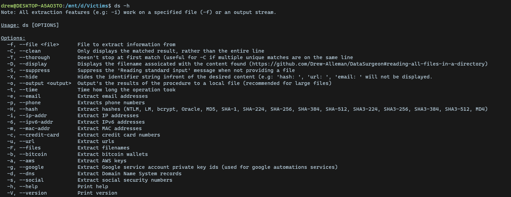
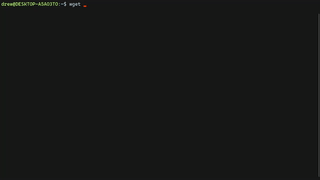

# DataSurgeon

DataSurgeon (ds) is a versatile tool designed for incident response, penetration testing, and CTF challenges. It allows for the extraction of various types of sensitive information including emails, phone numbers, hashes, credit cards, URLs, IP addresses, MAC addresses, SRV DNS records and a lot more!

* Supports Windows, Linux and MacOS

# Quick Links
* [Extraction Features](#extraction-features )
* [Quick Install](#quick-install)
* [Command Line Arguments](#command-line-arguments)
* [Examples](#examples)
* [Speed Tests](#speed-tests)
* [Recent Updates](#recent-updates)
* [Project Goals](#project-goals)

## Extraction Features 
* Emails
* Files
* Phone numbers
* Credit Cards
* Google API Private Key ID's
* Social Security Numbers
* AWS Keys
* Bitcoin wallets
* URL's
* IPv4 Addresses and IPv6 addresses
* MAC Addresses
* SRV DNS Records
* Extract Hashes
    - MD4 & MD5
    - SHA-1, SHA-224, SHA-256, SHA-384, SHA-512
    - SHA-3 224, SHA-3 256, SHA-3 384, SHA-3 512
    - MySQL 323, MySQL 41
    - NTLM
    - bcrypt

### Want more? 
Please read the contributing guidelines [here](https://github.com/Drew-Alleman/DataSurgeon/blob/main/CONTRIBUTING.md#adding-a-new-regex--extraction-feature)

# Quick Install
Install [Rust](https://www.rust-lang.org/tools/install) and [Github](https://desktop.github.com/)
### Linux
```
wget -O - https://raw.githubusercontent.com/Drew-Alleman/DataSurgeon/main/install/install.sh | bash
```

### Windows 
Enter the line below in an elevated powershell window. 
```
IEX (New-Object Net.WebClient).DownloadString("https://raw.githubusercontent.com/Drew-Alleman/DataSurgeon/main/install/install.ps1")
```
Relaunch your terminal and you will be able to use ```ds``` from the command line.

### Mac
```
curl --proto '=https' --tlsv1.2 -sSf https://raw.githubusercontent.com/Drew-Alleman/DataSurgeon/main/install/install.sh | sh
```

# Command Line Arguments

## Video Guide
[](https://www.youtube.com/watch?v=LAb6kBOWHwg)
# Examples
## Extracting Files From a Remote Webiste
Here I use ```wget``` to make a request to stackoverflow then I forward the body text to ```ds``` . The ```-F``` option will list all files found. ```--clean``` is used to remove any extra text that might have been returned (such as extra html). Then the result of is sent to ```uniq``` which removes any non unique files found. Ig you wanted you can remove the warning message at the top 'Reading standard input..' by using -S.
```
 wget -qO - https://www.stackoverflow.com | ds -F --clean | uniq
```


## Extracting Mac Addresses From an Output File
Here I am pulling all mac addresses found in [autodeauth's](https://github.com/Drew-Alleman/autodeauth) log file using the ```-m``` query. The ```--hide``` option will hide the identifer string infront of the results. In this case 'mac_address: ' is hidden from the output. The ```-T``` option is used to check the same line multiple times for matches. Normallly when a match is found the tool moves on to the next line rather then checking again. 
```
$ ./ds -m -T --hide -f /var/log/autodeauth/log     
2023-02-26 00:28:19 - Sending 500 deauth frames to network: BC:2E:48:E5:DE:FF -- PrivateNetwork
2023-02-26 00:35:22 - Sending 500 deauth frames to network: 90:58:51:1C:C9:E1 -- TestNet
```

## Reading all files in a directory
The line below will will read all files in the current directory recursively. The ```-D``` option is used to display the filename (-f is required for the filename to display) and -e used to search for emails.
```
$ find . -type f -exec ds -f {} -CDe \;
```


# Speed Tests
When no specific query is provided, ```ds``` will search through all possible types of data, which is <b>SIGNIFICANTLY</b> slower than using individual queries. The slowest query is ```--files```. Its also slightly faster to use ```cat``` to pipe the data to ```ds```. 

Below is the elapsed time when processing a 5GB test file generated by [ds-test](https://github.com/Drew-Alleman/ds-test). Each test was ran 3 times and the average time was recorded.

### Computer Specs 
```
Processor	Intel(R) Core(TM) i5-10400F CPU @ 2.90GHz, 2904 Mhz, 6 Core(s), 12 Logical Processor(s)
Ram         12.0 GB (11.9 GB usable)
```

## Searching all data types

Command         | Speed         
----------------|----------------
`cat test.txt \| ds -t` | 00h:02m:04s |
`ds -t -f test.txt` | 00h:02m:05s
`cat test.txt \| ds -t -o output.txt` | 00h:02m:06s

## Using specific queries

Command         | Speed          | Query Count
----------------|----------------|----------------
`cat test.txt \| ds -t -6` | 00h:00m:12s | 1
`cat test.txt \| ds -t -i -m` | 00h:00m:22 | 2
`cat test.txt \| ds -tF6c` | 00h:00m:32s | 3

# Recent Updates 
## 3/9/2023 | 1.0.6
* Added support for CSV output (e.g ```ds -o output.csv -f test.txt```)
## 3/7/2023 | 1.0.5
* Added -S / --suppress options to remove '[*] Reading standard input. If you meant to analyze a file use 'ds -f <FILE>' (ctrl+c to exit)' message
## 3/6/2023 | 1.0.4
* Updated url and phone number regex to return less false positives.

# Project Goals
* [Add Prompt to Installer](https://github.com/Drew-Alleman/DataSurgeon/issues/3)
* JSON and CSV output
* Untar/unzip and a directorty searching mode
* Base64 Detection and decoding
