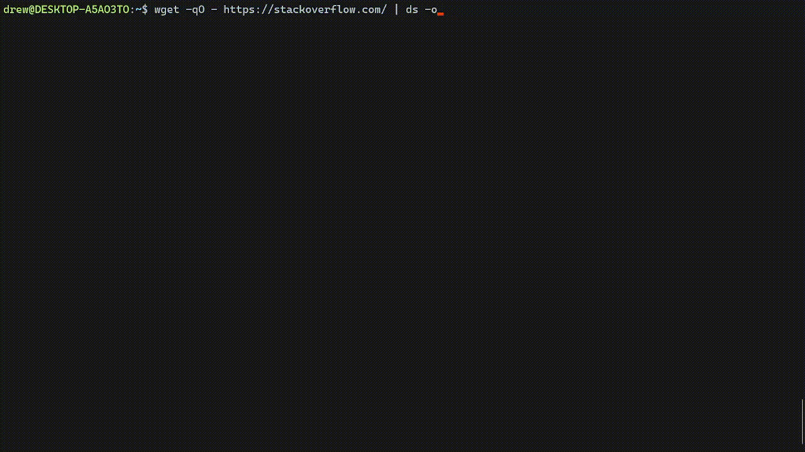

# DataSurgeon v1.2.3

DataSurgeon (ds) is a versatile tool designed for incident response, DLP, penetration testing, and CTF challenges. It allows for the extraction of various types of sensitive information including emails, phone numbers, hashes, credit cards, URLs, IP addresses, MAC addresses, SRV DNS records and a lot more!

* Supports Windows, Linux and MacOS
* Support recursive file analysis within directories
* Plugin Support
* CSV Output

# Quick Links
* [Extraction Features](#extraction-features )
* [Recent Updates](#recent-updates)
* [Quick Install](#quick-install)
* [Command Line Arguments](#command-line-arguments)
* [Examples](#examples)
* [Speed Tests](#speed-tests)
* [Managing Plugins](#managing-plugins)
    - [Where to Submit Plugin Suggestions](#plugin-suggestion)
    - [Adding a New Plugin](#adding-a-new-plugin)
    - [How to Use Your New Plugin](#how-to-use-your-new-plugin)
    - [Removing a Plugin](#removing-a-plugin)
    - [Listing All Plugins](#listing-all-plugins)
    - [Creating Your Own Plugin](https://github.com/DataSurgeon-ds/ds-winreg-plugin/blob/main/README.md#creating-your-own-plugin)
* <b>[Reporting Issues](#reporting-issues)</b>
* [Project Goals](#project-goals)

# Extraction Features 
To learn how to manage plugins please follow the guide [here](#managing-plugins). 
## Personal Information
* Emails
* Phone numbers
* Social Security Numbers

## Financial Information
* Credit Cards
* Bitcoin wallets

## Network Information
* URL's
* IPv4 Addresses and IPv6 addresses
* MAC Addresses
* SRV DNS Records

## Security Information
* Google API Private Key ID's
* AWS Keys
* [CVE Numbers](https://github.com/DataSurgeon-ds/ds-cve-plugin/) (PLUGIN)

## System and File Information 
* Files
* [Windows Registries](https://github.com/Drew-Alleman/ds-winreg-plugin/) (PLUGIN)
  
## Hashes
* MD4 & MD5
* SHA-1, SHA-224, SHA-256, SHA-384, SHA-512
* SHA-3 224, SHA-3 256, SHA-3 384, SHA-3 512
* MySQL 323, MySQL 41
* NTLM
* bcrypt

# Recent Updates
# 5/25/2023 | 1.2.0
This update brings a plugin management system to DataSurgeon. You can now add, remove, and list plugins using the ````--add````, ````--remove````, and ````--list```` options.

I also added a new plugin, [ds-winreg-plugin](https://github.com/Drew-Alleman/ds-winreg-plugin/), that can find Windows registry paths.

To add a new plugin, use ````--add <URL>````, where the URL is a GitHub repository with a ````plugins.json```` file. To remove a plugin, use ````--remove <URL>````. To see all your plugins, use the ````--list```` option.

Once a plugin is added, you can use it as an argument in DataSurgeon. The argument's name is the "Argument Long Name" in the plugin's ````plugins.json```` file.
# Quick Install
The quick installer can also be used to update DataSurgeon. 

## Video Guide
[](https://www.youtube.com/watch?v=_Sq8Qgndi4M)

Install [Rust](https://www.rust-lang.org/tools/install) and [Github](https://git-scm.com/downloads) then RESTART YOUR TERMINAL.

### Linux
```
read -p "Would you like to add 'ds' to your local bin? This will make 'ds' executable from any location in your terminal. (y/n) " response && wget -q -O - https://raw.githubusercontent.com/Drew-Alleman/DataSurgeon/main/install/install.sh | bash -s -- "$response"
```

### Windows 
Enter the line below in an elevated powershell window. 
```
IEX (New-Object Net.WebClient).DownloadString("https://raw.githubusercontent.com/Drew-Alleman/DataSurgeon/main/install/install.ps1")
```
Relaunch your terminal and you will be able to use ```ds``` from the command line.

### Mac
```
curl --proto '=https' --tlsv1.2 -sSf https://raw.githubusercontent.com/Drew-Alleman/DataSurgeon/main/install/install.sh | sh
```

# Command Line Arguments

## Video Guide
[](https://www.youtube.com/watch?v=LAb6kBOWHwg)
# Examples
## Extracting Files From a Remote Webiste
Here I use ```wget``` to make a request to stackoverflow then I forward the body text to ```ds``` . The ```-F``` option will list all files found. ```--clean``` is used to remove any extra text that might have been returned (such as extra html). Then the result of is sent to ```uniq``` which removes any non unique files found. Ig you wanted you can remove the warning message at the top 'Reading standard input..' by using -S.
```
$ wget -qO - https://www.stackoverflow.com | ds -F --clean | uniq
```


## Extracting Mac Addresses From an Output File
Here I am pulling all mac addresses found in [autodeauth's](https://github.com/Drew-Alleman/autodeauth) log file using the ```-m``` query. The ```--hide``` option will hide the identifer string infront of the results. In this case 'mac_address: ' is hidden from the output. The ```-T``` option is used to check the same line multiple times for matches. Normallly when a match is found the tool moves on to the next line rather then checking again. 
```
$ ./ds -m -T --hide -f /var/log/autodeauth/log     
2023-02-26 00:28:19 - Sending 500 deauth frames to network: BC:2E:48:E5:DE:FF -- PrivateNetwork
2023-02-26 00:35:22 - Sending 500 deauth frames to network: 90:58:51:1C:C9:E1 -- TestNet
```

## Reading all files in a directory
You can use the ```--directory``` option to read all files in the specified directory recursively. The ```-D``` option is used to display the filename where the match was found. ```-l``` or ```--line``` is used to display the line number the content was found on.
```
$ ds --directory test_dir/ -Dl
```


## CSV Output
To output your results to a CSV file, use the ```-o``` option followed by the name of the file you want to save your data to. The ```-D``` and ```-X``` are supported. The format is: ```ds -o <FILENAME>.csv``` (.csv is needed). 
```
 $ wget -qO - https://www.stackoverflow.com | ds -o output.csv -C
```



# Speed Tests
When no specific query is provided, ```ds``` will search through all possible types of data, which is <b>SIGNIFICANTLY</b> slower than using individual queries. The slowest query is ```--files```. Its also slightly faster to use ```cat``` to pipe the data to ```ds```. 

Below is the elapsed time when processing a 5GB test file generated by [ds-test](https://github.com/Drew-Alleman/ds-test). Each test was ran 3 times and the average time was recorded.

### Computer Specs 
```
Processor	Intel(R) Core(TM) i5-10400F CPU @ 2.90GHz, 2904 Mhz, 6 Core(s), 12 Logical Processor(s)
Ram         12.0 GB (11.9 GB usable)
```

## Searching all data types

Command         | Speed         
----------------|----------------
`cat test.txt \| ds -t` | 00h:02m:04s |
`ds -t -f test.txt` | 00h:02m:05s
`cat test.txt \| ds -t -o output.txt` | 00h:02m:06s

## Using specific queries

Command         | Speed          | Query Count
----------------|----------------|----------------
`cat test.txt \| ds -t -6` | 00h:00m:12s | 1
`cat test.txt \| ds -t -i -m` | 00h:00m:22 | 2
`cat test.txt \| ds -tF6c` | 00h:00m:32s | 3

## Managing Plugins
### Plugin Suggestion
If you want a suggest an idea for a new plugin please do it [here](https://github.com/Drew-Alleman/DataSurgeon/discussions/12). 

### Adding a New Plugin
To add a new plugin you need to use the ```--add <URL>``` option. The URL needs to be a remote github repository hosting a ```plugins.json``` file.
```
drew@DESKTOP-A5AO3TO:~$ ds --add https://github.com/Drew-Alleman/ds-winreg-plugin/
[*] Download and added plugin: https://github.com/Drew-Alleman/ds-winreg-plugin/
```
### Listing All Plugins
To list all plugins you can use the ```--list``` option.
```
drew@DESKTOP-A5AO3TO$ ds --list

Plugin File: /home/drew/.DataSurgeon/plugins.json

Source URL                                       | Argument Long Name
https://github.com/Drew-Alleman/ds-winreg-plugin | winregistry
```
### How to Use Your New Plugin
Once your plugin file is loaded, the option will be added as an additional argument. As you can see the name of the argument is the ```Argument Long Name```.

```
drew@DESKTOP-A5AO3TO$ ds -h

Options:
   ......
  -a, --aws                    Extract AWS keys
      --winregistry            Extracts windows registry paths
  -V, --version                Print version
```

### Removing a Plugin
To remove a plugin you don't want anymore you can use the ```--remove``` option.
```
drew@DESKTOP-A5AO3TO:~$ ds --remove https://github.com/Drew-Alleman/ds-winreg-plugin//
[*] Removed plugin: https://github.com/Drew-Alleman/ds-winreg-plugin//
```

# Reporting Issues
When filling out a new issue please answer ALL questions on the  [bug template](https://github.com/Drew-Alleman/DataSurgeon/blob/main/.github/ISSUE_TEMPLATE/bug_report.md). Issues with not enough information will be closed. 

# Project Goals
* JSON output
* Untar/unzip and a directorty searching mode
* Base64 Detection and decoding
